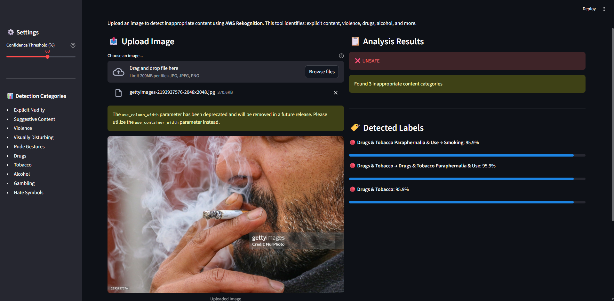

# 🛡️ Smart Image Moderator

A Streamlit web app that uses **AWS Rekognition** to detect and flag inappropriate content in images.

## 🚀 Features
- Upload any image (JPG, JPEG, PNG)
- Detects: nudity, violence, drugs, alcohol, hate symbols, and more
- Adjustable confidence threshold
- Real-time results visualization with Streamlit

## 🧠 Powered By
- **AWS Rekognition** — AI image moderation
- **Streamlit** — Web UI framework
- **Python** — Core logic

## 🖼️ Demo


## ⚙️ Setup Instructions

1. Clone this repository:
   ```bash
   git clone https://github.com/kruti-paneri93/image-moderation-recognizer.git
   cd smart-image-moderator
   ```
2. Install Dependencies:
    ```bash
    pip install -r requirements.txt
    ```
3. Create a .env file:
    ```bash
    AWS_ACCESS_KEY_ID=your_aws_key
    AWS_SECRET_ACCESS_KEY=your_aws_secret
    AWS_DEFAULT_REGION=us-east-1
    ```
4. Run the app:
    ```bash
    Streamlit run app.py
    ```